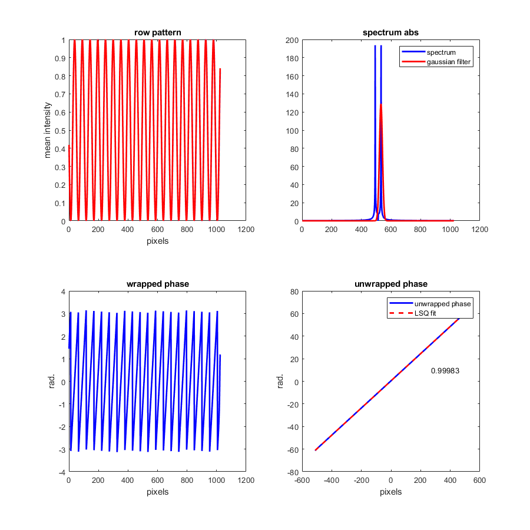

# 1D phase measurement

## About
Open source code to measure the phase and the period of 1D row signal/image with a periodic pattern in Matlab.

The library contains four functions to evaluate the period of a one dimensionnal pattern and the phase at the center of the vector with different algorithms.

## Reference articles
These functions rely on the published articles listed below:
> [1] Andre, A. N., Sandoz, P., Mauze, B., Jacquot, M., & Laurent, G. J. (2020). Sensing one nanometer over ten centimeters: A micro-encoded target for visual in-plane position measurement. IEEE/ASME Trans. Mechatronics. https://doi.org/10.1109/TMECH.2020.2965211

> [2] Guelpa, V., Laurent, G. J., Sandoz, P., Zea, J. G., & Clévy, C. (2014). Subpixelic measurement of large 1D displacements: Principle, processing algorithms, performances and software. Sensors, 14(3), 5056-5073. https://doi.org/10.3390/s140305056

## Features

All of the listed functions returns the same values which are the phase and the period in pixels of the pattern given in input.

#### Phase measurement with linear regression
This method is based on the fitting with a regression line of the unwrapped phase coming from the inverse Fourier transform, as described in the first cited article [1].

```matlab
[phase, periodInPixels] = phaseMeasurementWithLinearRegression(patternRow, approximatePeriodInPixels, displayFigures)
```

#### Phase measurement
This method is based on the retrieving of the main frequency peak specific to the one dimensionnel periodic pattern. The phase is directly computed on the Fourier transform spectrum.

```matlab
[phase, periodInPixels] = phaseMeasurement(patternRow, approximatePeriodInPixels, displayFigures)
```

#### Phase measurement with zero padding
This method is based on the same method as the one described above, except that the input pattern is zero padded to the right and to the left.

```matlab
[phase, periodInPixels] = phaseMeasurementWithZeroPadding(patternRow, approximatePeriodInPixels, displayFigures)
```

#### Phase measurement with peak interpolation
This method is based on a quadratic interpolation as described in the second article [2].

```matlab
[phase, periodInPixels] = phaseMeasurementWithPeakInterpolation(patternRow, approximatePeriodInPixels, displayFigures)
```

#### Figures display
The user is also able to display feddback figures by adding the parameter `'on'` at the end of the function inputs to better understand the method of phase measurement.



## License terms

Copyright (c) 2018-2020 UBFC, ENSMM, UFC, CNRS.

Authors: Antoine N. ANDRE, Guillaume J. LAURENT, Patrick SANDOZ, Valérian GUELPA

This program is free software: you can redistribute it and/or modify
it under the terms of the GNU General Public License as published by
the Free Software Foundation, either version 3 of the License, or
(at your option) any later version.

This program is distributed in the hope that it will be useful,
but WITHOUT ANY WARRANTY; without even the implied warranty of
MERCHANTABILITY or FITNESS FOR A PARTICULAR PURPOSE.  See the
GNU General Public License for more details.

In addition, we kindly ask you to acknowledge this library and its authors in any program or publication in which you use it. (You are not required to do so; it is up to your common sense to decide whether you want to comply with this request or not.) For general publications, we suggest referencing: Andre, A. N., Sandoz, P., Mauze, B., Jacquot, M., & Laurent, G. J. (2020). Sensing one nanometer over ten centimeters: A micro-encoded target for visual in-plane position measurement. IEEE/ASME Trans. Mechatronics.

Non-free and 2D versions of these phase measurement methods are available under terms different from those of the General Public License. For these alternatives terms you must purchase a license from FEMTO-ST Institute (UBFC licensing office). Users interested in buying a license can contact the authors alternatively at antoine.andre@femto-st.fr or guillaume.laurent@femto-st.fr or patrick.sandoz@femto-st.fr